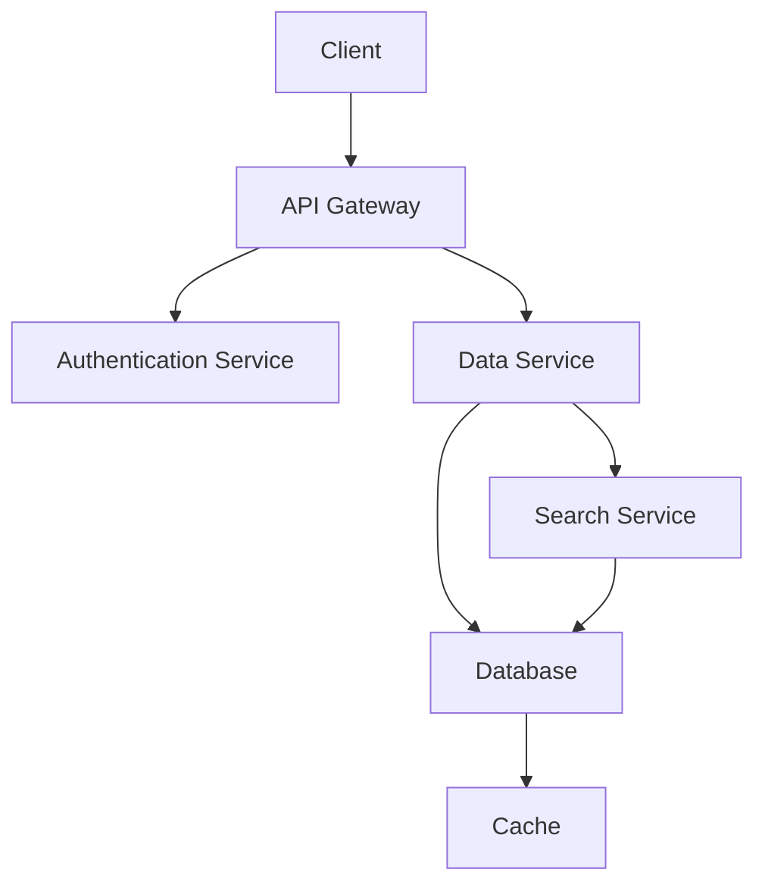

```mermaid
    graph TD;
        A[Client] --> B[API Gateway];
        B --> C[Authentication Service];
        B --> D[Data Service];
        D --> E[Database];
        E --> F[Cache];
        D --> G[Search Service];
        G --> E;
```